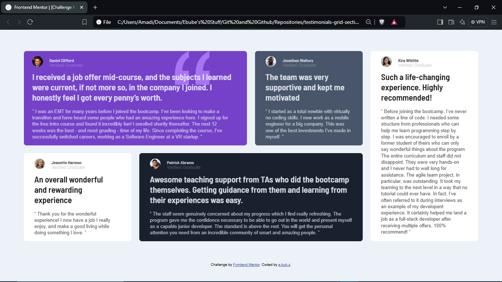
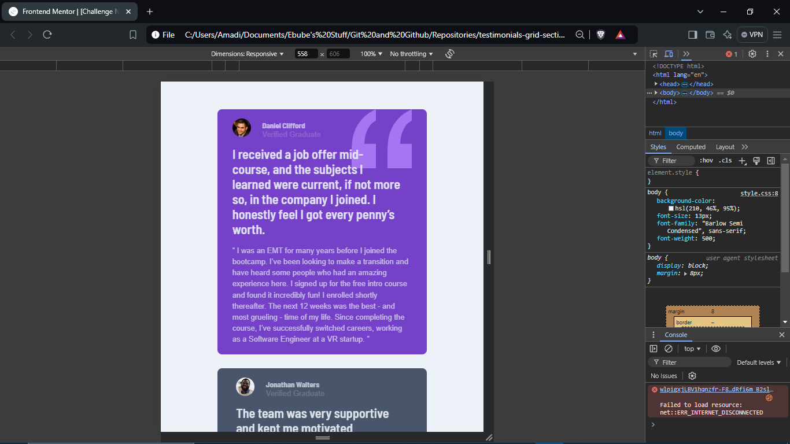
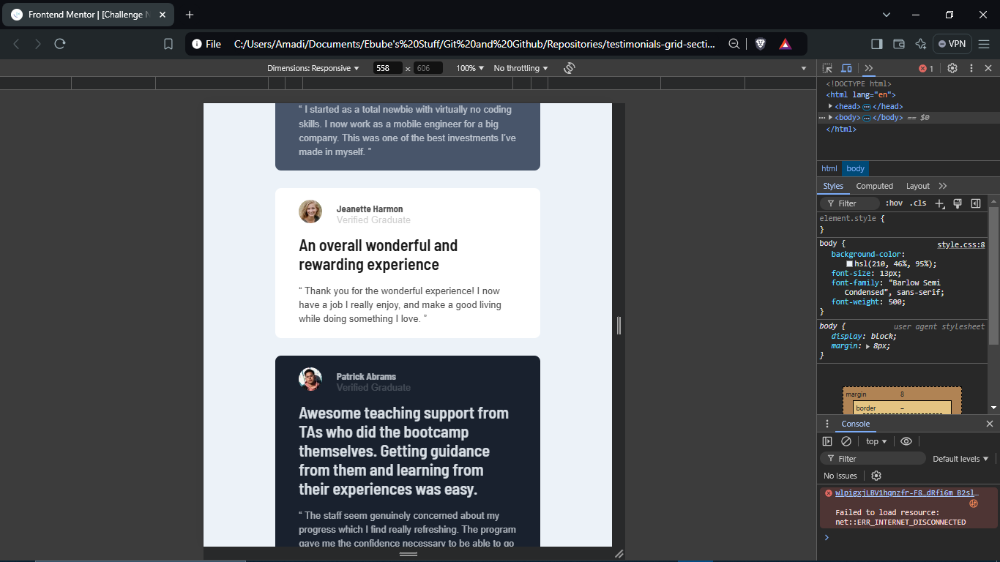
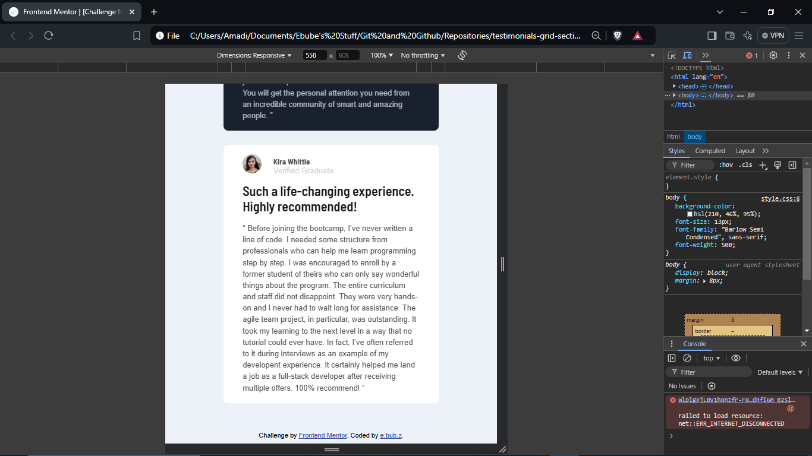

# Frontend Mentor - Testimonials grid section solution

This is a solution to the [Testimonials grid section challenge on Frontend Mentor](https://www.frontendmentor.io/challenges/testimonials-grid-section-Nnw6J7Un7). Frontend Mentor challenges help you improve your coding skills by building realistic projects. 

## Table of contents

  - [The challenge](#the-challenge)
  - [Screenshot](#screenshot)
  - [Links](#links)
  - [Built with](#built-with)
  - [Author](#author)

### The challenge

Users should be able to:

- View the optimal layout for the site depending on their device's screen size

### Screenshot

### Links

- Solution URL: [https://github.com/ebubz-dev/testimonials-grid-section](https://github.com/ebubz-dev/testimonials-grid-section)
- Live Site URL: [https://ebubz-dev.github.io/testimonials-grid-section/](https://ebubz-dev.github.io/testimonials-grid-section/)

## My process

### Built with

- Semantic HTML5 markup
- CSS custom properties
- CSS Grid

## Author

- Website - [Ebube Amadi](https://ebubz-dev.github.io)
- Frontend Mentor - [@ebubz-dev](https://www.frontendmentor.io/profile/ebubz-dev)